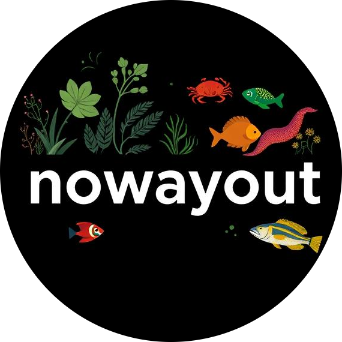

    

---

`nowayout` is a **super-fast** automated software pipeline for taxonomic classification of Eukaryotic mitochondrial reads. It uses a custom database to first identify mitochondrial reads and performs read classification on those identified reads. This pipeline has been specifically used for detecting and identifying insects or insect fragments in foods and also has been used as a verification tool for labeling claims when insects are used as foods. `nowayout` can also be used to detect any Eukaryotic DNA from shotgun metagenomic datasets. The pipeline is under active rapid development and more research is being currently undertaken to solve the ambigous read assignments.

`nowayout` currently works on **Illumina** short reads and in future will support **Oxford Nanopore** long reads.

It is written in **Nextflow** and is part of the modular data analysis pipelines at **HFP**.

\
&nbsp;

## Workflows

**CPIPES**:

- `nowayout`       : [README](./readme/nowayout.md).

\
&nbsp;

### Citing `nowayout`

---
Manuscript is in preparation. Please cite our **GitHub** repo.

>
>**nowayout: an automated pipeline for taxonomic classification of Eukaryotic mitochondrial reads (<https://github.com/CFSAN-Biostatistics/nowayout>).**
>
>Kranti Konganti, Monica Pava-Ripoll, Amanda Windsor, Christopher Grim, Mark Mammel and Padmini Ramachandran
>

\
&nbsp;

### Future work

---

- Incorporation of custom algorithms and classification methods to deal with ambiguos read assignments.
- Incorporation of methods to support processing of Oxford Nanopore reads.

\
&nbsp;

### Caveats

---

- The main workflow has been used for **research purposes** only.
- Analysis results should be interpreted with caution.

\
&nbsp;

### Disclaimer

---
**HFP, FDA** assumes no responsibility whatsoever for use by other parties of the Software, its source code, documentation or compiled or uncompiled executables, and makes no guarantees, expressed or implied, about its quality, reliability, or any other characteristic. Further, **HFP, FDA** makes no representations that the use of the Software will not infringe any patent or proprietary rights of third parties. The use of this code in no way implies endorsement by the **HFP, FDA** or confers any advantage in regulatory decisions.
